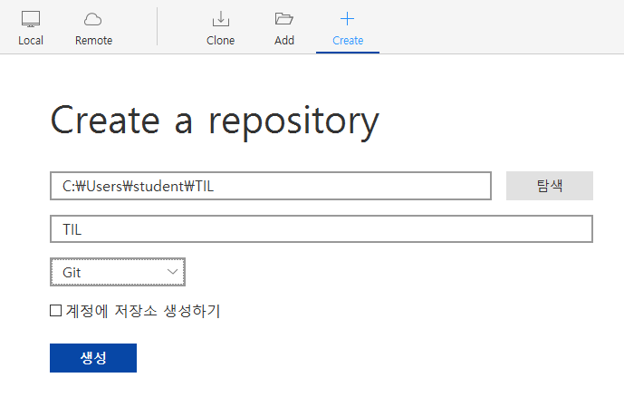
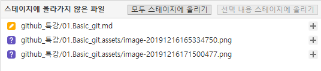
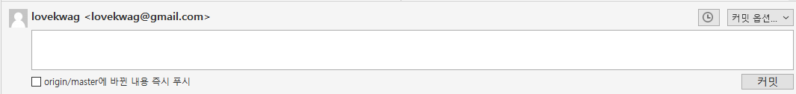
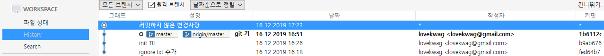

# Git 기초

## 개념

### SCM이란?

sorce code manager 의 약자로, 코드의 버전을 관리하기 위해 존재한다.

### Git

git은 Linus Torvalds가 만든 scm으로, 현제 가장 많이 사용된다.

### Github

github는 git이 관리하는 repo의원격 저장소를 제공하는서비스다.가장 많이 사용하며, 오픈소스 프로젝트를 이 성장하는 곳이다. 최근 MS에 인수 되었다.

## Sorcetree

### step 01.

New tab을 누른다

### step 02.

Creat을 누르고 경로설정을 한 후에 생성을 버튼을 눌러준다.

### Step 03.

파일을 생성하면 스테이지에 올라가지 않은 파일 textbox에 파일 항목들이 생성이 된다.

스테이지에 올리 파일을 선택 후 스테이지에 올리기 버튼이나 모두 스테이지에 올리기 버튼을 눌러서 스테이지로 파일을 옮겨 놓는다.

### step 04.

 변경사항/추가/삭제 기타 코멘트를 작성하여, 커밋을 버튼을 누른다.

### step 05

History항목을 누르면 커밋한 내용을 볼 수 있다.